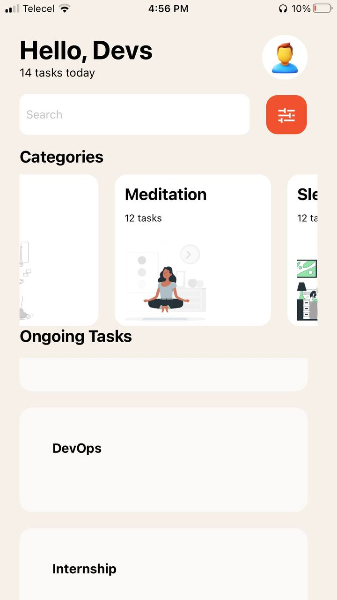

# React Native Application
 The simple homepage built using React Native.

# Brief description of components usage
- Text: A primitive component that displays text. It supports nesting, styling, and touch handling.
- View: A container that supports layout with Flexbox, style, some touch handling, and accessibility controls.
- Image: Renders an image from a local resource. It supports scaling, cropping, and other transformations.
- TouchableOpacity: A wrapper for making views respond properly to touches. On press down, the opacity of the wrapped view is decreased, giving visual feedback to the user.
- TextInput: A standard multi-line box that allows the user to enter and edit text. It can be customized with various props to handle different types of inputs.
- FlatList: A simple list component for rendering large lists of data. It only renders items that fit on the screen, making it memory-efficient.

## Screenshot

